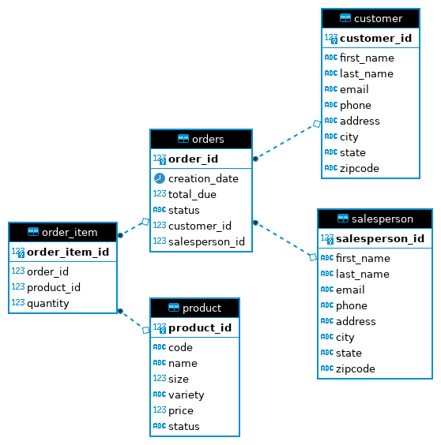

# Introduction
The purpose of this application is to utilize the JDBC API in Java in order to execute queries on a database. The JDBC API handles connections to RDBMS databases, executes queries written using SQL strings and can manage result sets that are retrieved from the databases. A PostgreSQL database is provisioned using Docker and is populated with data in several tables. Through this Java app (that is built with Maven), queries can be executed on this database which include inserting into tables, updating records and deleting records. As well, the result sets can be iterated over in order to examine them. 
The database can be queried through the `JDBCexecutor.java` script which makes use of a `Customer` and `CustomerDAO` object. The `CustomerDAO` contains methods (which return `Customer` objects) used to perform CRUD operations on the database and hides the implementation details from the main method in the `JDBCexecutor` script. 

# Implementation
A PSQL database was first provisioned using Docker:
```
> ./psql_docker.sh start postgres password

# creating the tables
> psql -h localhost -U postgres -f database.sql
> psql -h localhost -U postgres -d hplussport -f customer.sql
> psql -h localhost -U postgres -d hplussport -f product.sql
> psql -h localhost -U postgres -d hplussport -f salesperson.sql
> psql -h localhost -U postgres -d hplussport -f orders.sql
```

The tables and their relationships can be seen in the ER diagram.
Java and the JDBC API were then used to access this database.

## ER Diagram


## Design Patterns
Two main design patterns used for accessing databases in Java include DAO (Data Access Object) and the Repository design pattern.
This project makes use of the DAO pattern although descriptions for both can be seen below.

### DAO Pattern
The DAO design pattern revolves around hiding the implementation for accessing data using an abstract API. It essentially hides the complexity involved with performing CRUD (create, read, update, delete) operations on the database. This abstract API can then be implemented to work with various objects which represent the data. (E.g. A CustomerDAO can be used to perform CRUD operations given Customer objects containing the customer information). This design pattern is at a lower level (closer to the storage) than the Repository pattern.


### Repository Pattern
The Repository design pattern is similar the DAO pattern in that it hides the implementation details when querying the data. However, this design pattern is at a higher level than the DAO (closer to the business logic part of a larger application). This pattern can retrieve and store data from the database using multiple DAOs. In this way, information can be aggregated from various tables or data sources to form a more complete picture which is useful for driving business decisions.

# Tests

## Testing Database creation
The database was created using the `database.sql` script. 
To check if it was created, we can look at the list of PSQL databases:
```
> psql -h localhost -U postgres
postgres=# \l

                                 List of databases
    Name    |  Owner   | Encoding |  Collate   |   Ctype    |   Access privileges   
------------+----------+----------+------------+------------+-----------------------
 hplussport | postgres | UTF8     | en_US.utf8 | en_US.utf8 | =Tc/postgres         +
```
This shows that that `hplussport` database was indeed created.

## Testing table creation
To check if the tables were created properly, we can look at the list of tables in the `hplussport` database.

```
postgres=# \c hplussport
postgres=# \dt

           List of relations
 Schema |    Name     | Type  |  Owner   
--------+-------------+-------+----------
 public | customer    | table | postgres
 public | order_item  | table | postgres
 public | orders      | table | postgres
 public | product     | table | postgres
 public | salesperson | table | postgres
```

All 5 tables were created correctly. 

## Testing table data set up
To check that the tables contain the correct data, the `customer` table was used to see if the first few rows contained correct entries and if the total number of rows is correct.
```
SELECT * FROM customer
LIMIT 3;

 customer_id | first_name | last_name |        email        |     phone     |        address         |    city     | state | zipcode 
-------------+------------+-----------+---------------------+---------------+------------------------+-------------+-------+---------
         100 | Carol      | Shaw      | cshaw0@mlb.com      | (206)804-8771 | 8157 Longview Court    | Seattle     | WA    | 98121
         101 | Elizabeth  | Carr      | ecarr1@oracle.com   | (512)187-2507 | 3934 Petterle Trail    | Austin      | TX    | 78732
         102 | Ernest     | Ramos     | eramos2@plala.or.jp | (816)540-4257 | 8699 Clarendon Terrace | Kansas City | MO    | 64199

```
These rows match the data inserted in `customer.sql`.

```
SELECT COUNT(*) FROM customer;

1001
```
The number of rows match the expected number.

## Inserting Data
A new customer "George Washington" was added to the database the test insertion.
The relevant code from the `JDBCexecutor` script can be seen below:
```
CustomerDAO customerDAO = new CustomerDAO(connection);
Customer customer = new Customer();
customer.setFirstName("George");
customer.setLastName("Washington");
customer.setEmail("george.washington@wh.gov");
customer.setPhone("(555) 123-4567");
customer.setAddress("1234 Main st");
customer.setCity("Mount Vernon");
customer.setState("VA");
customer.setZipCode("22121");
customerDAO.create(customer);
```

To see if the data was inserted correctly, this was checked using the psql command line tool.

```
SELECT * FROM customer
WHERE first_name='George' and last_name='Washington'

 customer_id | first_name | last_name  |       email        |     phone      |   address    |     city     | state | zipcode
 
-------------+------------+------------+--------------------+----------------+--------------+--------------+-------+---------
       10000 | George     | Washington | george.washington@wh.gov | (555) 123-4567 | 1234 Main st | Mount Vernon | VA    | 22121
```

As seen, the data was inserted correctly.

## Updating Data
To test if the data could be updated, the email for "George Washington" was changed. The old and new emails were then printed out.
The relevant code from the `JDBCexecutor` script can be seen below:
```
Connection connection = dcm.getConnection();
CustomerDAO customerDAO = new CustomerDAO(connection);
Customer customer = customerDAO.findById(10000);
System.out.println(customer.getFirstName() + " " + customer.getLastName() + " " + customer.getEmail());
customer.setEmail("gwashington@wh.gov");
customer = customerDAO.update(customer);
System.out.println(customer.getFirstName() + " " + customer.getLastName() + " " + customer.getEmail());
```
The script then prints the following which indicates that the record was indeed updated with the new email:
```
George Washington george.washington@wh.gov
George Washington gwashington@wh.gov
```

## Deleting Data
To test if data could be deleted, a record was first inserted and then deleted. 
The relevant code from the `JDBCexecutor` script can be seen below:

```
# Inserting new customer
Customer customer = new Customer();
customer.setFirstName("John");
customer.setLastName("Adams");
customer.setEmail("jadams.wh.gov");
customer.setAddress("1234 main st");
customer.setCity("Arlington");
customer.setState("VA");
customer.setPhone("(555)-321-3214");
customer.setZipCode("01234");
Customer dbCustomer = customerDAO.create(customer);

# Deleting the new customer
dbCustomer = customerDAO.findById(dbCustomer.getId());
customerDAO.delete(dbCustomer.getId());
```
The psql command line tool was used to confirm that this customer was removed.

```
SELECT * FROM customer
where first_name='John' and last_name='Adams';

 customer_id | first_name | last_name | email | phone | address | city | state | zipcode 
-------------+------------+-----------+-------+-------+---------+------+-------+---------
(0 rows)
```
This shows that "John Adams" customer was indeed deleted.

# Next Steps
This application currently uses one DAO to access and modify the `customer` table. 
More DAOs could be implemented to access the other tables. Further work could involve using a Repository design pattern which makes use of multiple DAOs and more complex SQL queries for analysis.
