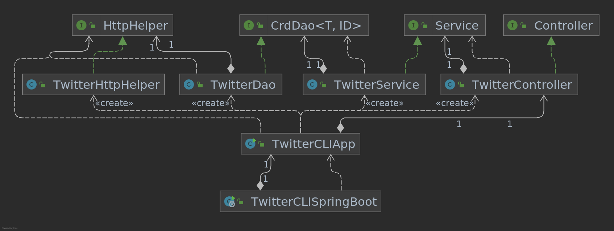

# Introduction
The purpose of this project is to create a Java application that can create, read and delete tweets 
from the CLI by utilizing the Twitter REST API. The Java app builds the URI required and sends the appropriate HTTP requests (e.g. GET, POST, DELETE) to the API using a HTTP Client (Apache Http Components) and prints out the corresponding tweets in JSON format. This app consists of several layers including a controller (parses CLI arguments), service (handles business logic) and a data access object which accesses the tweets on Twitter via the REST API. It was tested using JUnit to unit test the methods and Mockito to mock the dependencies. 
It was packaged using Maven as a SpringBoot application and deployed to Docker Hub as a Docker Image which can be pulled for use.

# Quick Start
Below are some commands to run the application using the Docker image from Docker Hub.
```
# Creating a Tweet
docker run --rm \
-e consumerKey=${consumerKey} \
-e consumerSecret=${consumerSecret} \
-e accessToken=${accessToken} \
-e tokenSecret=${tokenSecret} \
armathews/twitter_app post "My First Tweet" "43:79" #coordinates are latitude:longitude

# Finding a tweet by ID (replace last line in docker run command)

## Full tweet 
armathews/twitter_app show 1276568976764686343 

## Show only certain fields (id,text in this case)
armathews/twitter_app show 1276568976764686343 "id,text" 

# Deleting one or more tweets by ID (replace last line in docker run command)
armathews/twitter_app delete "1276568976764686343,1200145224103841792"
```
<b>Note</b>: Secrets/Tokens are required for authentication in order to perform these operations which can be set using environment variables.

# Design
This app implements the MVC architecture (except for the view). 
It uses a Tweet model which is an object used to get or post a tweet from Twitter along with a controller which parses the CLI arguments.
Other layers are present as well and their relationships can be seen in the UML diagram.

## UML diagram
The UML diagram can be seen below:


### Components:
* `TwitterDAO`
  * Constructs URIs needed to make HTTP requests using the Twitter API
  * Executes the HTTP requests using the `HttpHelper` class 
* `TwitterService`
  * Handles the business logic of posting and finding Tweets (tweet message cannot exceed 140 characters, tweet ID must be numeric)
* `Controller`
  * Parses CLI arguments and calls appropriate method in service layer
* `App`
  * Instantiates all necessary components and uses `run` method to perform tweet operations by calling methods in the `controller`
  * Tweets are printed in JSON format
* `TwitterCLISpringBoot`
  * Utilizes SpringBoot to automatically handle dependencies
  * Calls `run` method in `App`

## Models
The `Tweet` model is a simplified version of the full Tweet object. An example of the attributes of the model can be seen below:
```
{
   "created_at":"Mon Feb 18 21:24:39 +0000 2019",
   "id":1097607853932564480,
   "id_str":"1097607853932564480",
   "text":"My First Tweet",
   "entities":{
      "hashtags":[
         {
            "text":"first",
            "indices":[
               211,
               216
            ]
         }
      ],
      "user_mentions":[
         {
            "name":"Twitter API",
            "indices":[
               4,
               15
            ],
            "screen_name":"twitterapi",
            "id":6253282,
            "id_str":"6253282"
         }
      ]
   },
   "coordinates":{
      "coordinates":[
         -75.14310264,
         40.05701649
      ],
      "type":"Point"
   },
   "retweet_count":0,
   "favorite_count":0,
   "favorited":false,
   "retweeted":false
}
```
Five classes were used to create this model, these being `Coordinates`, `Entitites`, `Hashtag`, `Tweet` and `UserMention`.

## Spring
SpringBoot was used in the final version of this app and handles the dependencies using an IoC container.
Annotations are placed in the various classes indicating if they are a component, service, repository or controller. 
In the `TwitterCLISpringBoot` program, the directory in which to look for the components is specified as an argument to the `@SpringBootApplication` annotation.
As well, the `AutoWired` annotation is used to inject the dependencies through the constructor of the `TwitterCLISpringBoot` class.

# Test
Several unit and integration tests were performed using JUnit along with Mockito to mock the dependencies.
The unit tests were performed using Mockito in order to test the functionality of each individual module without having to instantiate the dependency classes.
Examples of these tests can be seen below:

```
# Unit testing showTweet method in service layer
# mocked DAO is injected into TwitterService

    @Mock
    CrdDao dao;

    @InjectMocks
    TwitterService service;
    
    @Test(expected = RuntimeException.class)
    public void showTweet() {
        String idTest = "1234";
        when(dao.findById(anyString(), eq(null))).thenReturn(new Tweet());
        service.showTweet(idTest, null);

        //throws Runtime exception, ID is not a
        String idErr = "A12345";
        service.showTweet(idErr, null);
    }
    
# Integration testing of showTweet in service layer
# Note that dependencies are instantiated instead of injected

    private TwitterService service;

    @Before
    public void init() {
        String CONSUMER_KEY = System.getenv("consumerKey");
        String CONSUMER_SECRET = System.getenv("consumerSecret");
        String ACCESS_TOKEN = System.getenv("accessToken");
        String TOKEN_SECRET = System.getenv("tokenSecret");

        HttpHelper httpHelper = new TwitterHttpHelper(CONSUMER_KEY, CONSUMER_SECRET, ACCESS_TOKEN, TOKEN_SECRET);
        TwitterDao dao = new TwitterDao(httpHelper);
        this.service = new TwitterService(dao);
    }
    
    @Test
    public void showTweet() throws JsonProcessingException {
        Tweet tweet = service.postTweet(TweetUtil.buildTweet("show tweet test text " + System.currentTimeMillis(), "56:78"));

        //show all fields
        Tweet foundTweet = service.showTweet(tweet.getId(), null);
        System.out.println("All fields of tweet:");
        System.out.println(JsonParsing.toJson(foundTweet, true, false, null));

        //show only id and coords
        String[] fields = {"id", "coordinates"};
        Tweet foundTweetFields = service.showTweet(tweet.getId(), fields);
        System.out.println("Only id and coords");
        System.out.println(JsonParsing.toJson(foundTweetFields, true, false, null));
    }
```

## Deployment
This app was deployed onto Docker Hub by creating and pushing a Docker image.
The steps to create the Dockerfile and build the image can be seen below:
```
# Create the Dockerfile
cat > Dockerfile << EOF
FROM openjdk:8-alpine
COPY target/twitter*.jar /usr/local/app/twitter/lib/twitter.jar
ENTRYPOINT ["java","-jar","/usr/local/app/twitter/lib/twitter.jar"]
EOF

# Package the Java app
mvn clean package

# Building the Docker image
docker build -t armathews/twitter_app .

# Push to Docker Hub
docker push armathews/twitter_app
```

# Improvements
- Improve integration tests by adding a cleanup step where all tweets created solely for testing purposes are deleted
- Allow tweet messages to be created from files (easier to edit than typing on the command line)
- Add optional confirmation of tweet text before deleting tweets to ensure that tweets are not deleted by mistake