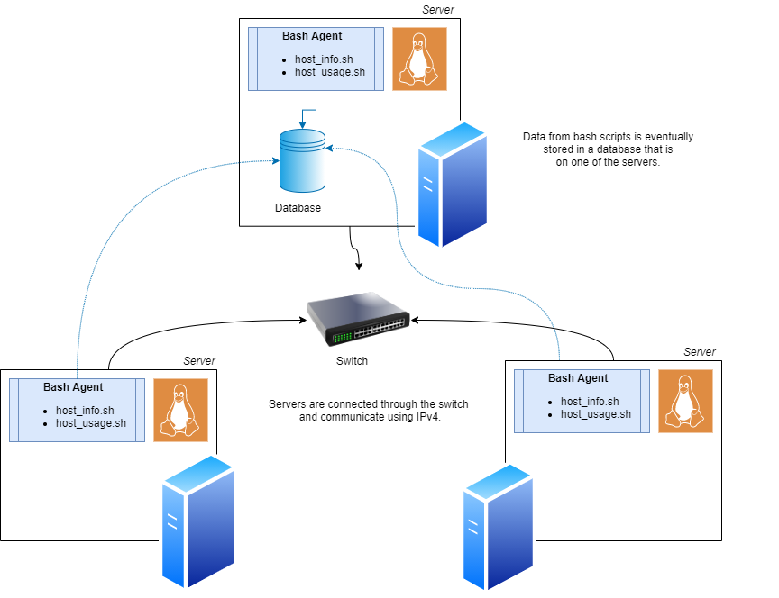

# Linux Cluster Monitoring Agent
# Introduction
The purpose of this project is to design and implement a Linux Cluster Monitoring Agent which will aid the Jarvis Linux Cluster Administration (LCA) team.
The LCA team manages a Linux cluster with 10 servers, each running CentOS 7, and is interested in recording the hardware specifications and real-time resource usage for each server.
In this project, an MVP is developed using bash scripts, docker, postgreSQL and git.
The overall design involves a set of bash scripts which are to be used on each server to record data and send it to a postgreSQL database which 
will be on one of the servers. The database is provisioned using Docker (which allows it to be easily deployed) and resource usage data will be sent to the database every minute.
In this way, the LCA team can then use the data to better utilize and manage their resources.

# Quick Start
Below are some quick start commands to run the relevant bash scripts and set up the database tables.
```
# Starting/Stopping the psql instance (provisioned using Docker)
# container must first be created
./scripts/psql_docker.sh create postgres password

# starting the container
./scripts/psql_docker.sh start postgres password

# Creating a host_agent database by first connecting to the PSQL instance
export PGPASSWORD=password
psql -h localhost -p 5432 -U postgres -W
>postgres=# CREATE DATABASE host_agent;

# Creating tables using ddl.sql
psql -h localhost -p 5432 -U postgres -d host_agent -f sql/ddl.sql

# Inserting hardware specs data into the database using host_info.sh
./scripts/host_info.sh localhost 5432 host_agent postgres password

# Inserting hardware usage data into the database using host_usage.sh
./scripts/host_usage.sh localhost 5432 host_agent postgres password

# Crontab setup
# edit crontab jobs
crontab -e

# add to crontab and use path to host_usage.sh
* * * * * bash [/home/centos/dev/jarvis_data_eng_anita/linux_sql/scripts/host_usage.sh] localhost 5432 host_agent postgres password > /tmp/host_usage.log
```

# Implementation
Each server will have a copy of the `host_info.sh` and `host_usage.sh` scripts which will record the hardware
specifications and the resource usage (e.g. disk available) of each server. The hardware specifications
are collected once while the resource usage values are collected every minute (configured to run using `crontab`).
After collecting the data, these scripts then record the data in a postgreSQL database called `host_agent` which contains
two tables called `host_info` and `host_usage`. This database is provisioned using Docker by creating a container using a psql image and creating a volume (`pgdata`) to preserve
the data from this container. 

## Architecture 
An architecture diagram using 3 Linux hosts as an example is shown below.


## Scripts
Below are the descriptions for the scripts along with their usage.
- **`psql_docker.sh`:**
  - provisions a PSQL instance using Docker
  - PSQL instance must be created, then started
```
  ./scripts/psql_docker.sh create|start|stop DB_USERNAME DB_PASSWORD
```
- **`ddl.sql`:**
  - creates `host_usage` and `host_info` tables in the `host_agent` database
```
  psql -h HOST_NAME -p PSQL_PORT -U DB_USERNAME -d host_agent -f sql/ddl.sql
```
- **`host_info.sh`:**
  - collects and inserts hardware data into the host_info table in the host_agent postgreSQL database
  - information is collected and inserted <b>once</b>
```
  ./scripts/host_info.sh HOST_NAME PSQL_PORT host_agent DB_USERNAME DB_PASSWORD
```
- **`host_usage.sh`:**
  - collects and inserts resource usage data into the host_usage table in the host_agent postgreSQL database
  - information is collected and inserted every <b>minute</b>
```
  ./scripts/host_usage.sh HOST_NAME PSQL_PORT host_agent DB_USERNAME DB_PASSWORD
```
- **`crontab`:**
  - edit the crontab file with the path to the host_usage.sh script that will be executed every minute
```
  * * * * * bash [path to host_usage.sh] HOST_NAME PSQL_PORT host_agent DB_USERNAME DB_PASSWORD > /tmp/host_usage.log
```
- **`queries.sql`:** 
  - 3 queries showing how the host_usage data can be interpreted
  - Query 1: Inspecting total memory across hosts with the same number of cpus. This allows the LCA team to determine the right hosts for certain jobs.
  - Query 2: Calculating the average memory usage in percent over 5 minute intervals. This allows the LCA team to determine the extent to which the hosts are being utilized over time.
  - Query 3: Detecting failure of the cron job to regularly insert data into the host_usage table. If the table is not updated by the same host at least 3 times in 5 minutes, it can be assumed that the server failed and the team must further inspect this.
  - Queries were executed on the database using DBeaver

## Database Modeling

The schemas for the `host_info` and `host_usage` tables can be seen below.

`host_info` :

| id         | hostname | cpu_number  |  cpu_architecture | cpu_model  | cpu_mhz   | l2_cache  | total_mem | timestamp |
| ----------- | ----------- | --------   |  ------------     | ---------- | --------  | --------- | --------- | --------- |
| serial (primary key)   | varchar       | integer    |  varchar          | varchar    | numeric   | integer   | integer   | timestamp |


`host_usage` :

| timestamp | host_id | memory_free | cpu_idle | cpu_kernel | disk_io | disk_available |
| --------- | --------| ---------   | ---------| --------   | ------- | -------------- |
| timestamp | integer (foreign key to id on host_info) | integer     | integer      | integer | integer | integer       |

# Testing

## Bash Scripts

The `psql_docker.sh` script was tested by creating and starting the container and checking that this was indeed the case using `docker ps -a`.
Tests were also done to ensure that the correct number of CLI arguments were passed (3) and that an error was thrown when attempting to start/stop a container that had not been created yet.

```
$ ./scripts/psql_docker.sh create postgres
Create requires username and password

$ ./scripts/psql_docker.sh create postgres password
Error: No such container: jrvs-psql
Creating container

$ docker ps -a
CONTAINER ID   IMAGE                 COMMAND                  CREATED      STATUS                   PORTS     NAMES
f3e9c248e90d   postgres:9.6-alpine   "docker-entrypoint.s…"   2 days ago   Exited (0) 9 hours ago             jrvs-psql

$ ./scripts/psql_docker.sh create postgres password
Container already exists.

$ ./scripts/psql_docker.sh starting postgres password
Illegal command
Commands: start|stop|create

$ ./scripts/psql_docker.sh start postgres password
CONTAINER ID   IMAGE                 COMMAND                  CREATED      STATUS           PORTS                                          NAMES
f3e9c248e90d   postgres:9.6-alpine   "docker-entrypoint.s…"   2 days ago   Up 10 seconds    0.0.0.0:5432->5432/tcp, :::5432->5432/tcp      jrvs-psql

```

The `host_info.sh` and `host_usage.sh` scripts were tested by comparing inserted data to that obtained from `/proc/meminfo` and
the `lscpu` and `vmstat` commands. 

```
$ lscpu

Architecture:          x86_64
CPU op-mode(s):        32-bit, 64-bit
Byte Order:            Little Endian
CPU(s):                2
On-line CPU(s) list:   0,1
Thread(s) per core:    2
Core(s) per socket:    1
Socket(s):             1
NUMA node(s):          1
Vendor ID:             GenuineIntel
CPU family:            6
Model:                 63
Model name:            Intel(R) Xeon(R) CPU @ 2.30GHz
Stepping:              0
CPU MHz:               2299.998
BogoMIPS:              4599.99
Hypervisor vendor:     KVM
Virtualization type:   full
L1d cache:             32K
L1i cache:             32K
L2 cache:              256K
L3 cache:              46080K
NUMA node0 CPU(s):     0,1
...

$ cat /proc/meminfo
MemTotal:        7489644 kB
MemFree:         1608132 kB
MemAvailable:    4116120 kB

...

$ vmstat -t
procs -----------memory---------- ---swap-- -----io---- -system-- ------cpu----- -----timestamp-----
 r  b   swpd   free   buff  cache   si   so    bi    bo   in   cs us sy id wa st                 UTC
 1  0      0 2200076   6032 2595112    0    0    98     9  359  670  6  1 94  0  0 2021-11-18 05:54:37

$ ./scripts/host_info.sh localhost 5432 host_agent postgres password
$ ./scripts/host_usage.sh localhost 5432 host_agent postgres password
```

```
SELECT * FROM host_info;
```

 | id | hostname | cpu_number | cpu_architecture | cpu_model  | cpu_mhz  | l2_cache | total_mem | timestamp |
| ---- | --------| -----------| -----------------| -----------| ---------| ---------| --------- | ----------| 
 | 1 | jrvs-remote-desktop-centos7.us-east1-c.c.alert-port-331615.internal |  2 | x86_64  | Intel(R) Xeon(R) CPU @ 2.30GHz | 2299.998 |  256 |  7314 | 2021-11-18 05:55:56

```
SELECT * FROM host_usage
```
| timestamp | host_id | memory_free | cpu_idle | cpu_kernel  | disk_io  | disk_available | 
| ---- | --------| -----------| -----------------| -----------| ---------| ---------| 
| 2021-11-18 06:03:10 | 1 |  1717 | 93 | 6 | 0 |  24351 |  

The records created match the expected data with slight variations due to the timing.

The SQL queries were tested by inserting sample values into the host_info and host_usage tables and examining the results.

Testing for Query 1: 
```
insert into host_info values (1, 'host1', 1, 'x86_64', 'Intel(R) Xeon(R) CPU @ 2.30GHz', 2299.998, 256, 2048, TIMESTAMP '2021-06-22 19:10:25-07'),
						     (5, 'host2', 1, 'x86_64', 'Intel(R) Xeon(R) CPU @ 2.30GHz', 2299.998, 256, 1568, TIMESTAMP '2021-06-24 19:10:25-07'),
							 (9, 'host3', 1, 'x86_64', 'Intel(R) Xeon(R) CPU @ 2.30GHz', 2299.998, 256, 1024, TIMESTAMP '2021-06-23 19:10:25-07'),
							 (4, 'host4', 2, 'x86_64', 'Intel(R) Xeon(R) CPU @ 2.30GHz', 2299.998, 256, 4088, TIMESTAMP '2021-06-26 19:10:25-07'),
							 (6, 'host5', 2, 'x86_64', 'Intel(R) Xeon(R) CPU @ 2.30GHz', 2299.998, 256, 1024, TIMESTAMP '2021-06-27 19:10:25-07');

SELECT cpu_number, id AS host_id, total_mem
FROM host_info
ORDER BY 1, 3 DESC;
```
The select statement returns:

| cpu_number | host_id | total_mem |
| ---------- | ------- | --------- |
| 1          |    1    |    2048   |
| 1          |    5    |    1568   |
| 1          |    9    |    1024   |
| 2          |    4    |    4088   |
| 2          |    6    |    1024   |

This is the expected result as the cpu_number is in ascending order and within each cpu_number group, the total memory is listed in descending order.

Testing for Query 2:

```
insert into host_usage values   (TIMESTAMP '2021-06-22 19:00:25-07', 1, 400, 93, 3, 0, 24000),
							    (TIMESTAMP '2021-06-22 19:01:25-07', 1, 500, 93, 3, 0, 24000),
							    (TIMESTAMP '2021-06-22 19:02:25-07', 1, 600, 94, 4, 0, 24000),
								(TIMESTAMP '2021-06-22 19:03:25-07', 1, 450, 93, 5, 0, 24000),
								(TIMESTAMP '2021-06-22 19:04:25-07', 1, 300, 92, 4, 0, 24000),
								(TIMESTAMP '2021-06-22 19:05:25-07', 5, 250, 80, 5, 0, 23000),
								(TIMESTAMP '2021-06-22 19:06:25-07', 5, 400, 85, 5, 0, 23000),
								(TIMESTAMP '2021-06-22 19:07:25-07', 5, 450, 87, 5, 0, 23000),
								(TIMESTAMP '2021-06-22 19:08:25-07', 5, 550, 90, 5, 0, 23000),
								(TIMESTAMP '2021-06-22 19:09:25-07', 5, 600, 88, 5, 0, 23000),
								(TIMESTAMP '2021-06-22 19:10:25-07', 5, 250, 87, 5, 0, 23000),
								(TIMESTAMP '2021-06-22 19:11:25-07', 5, 400, 87, 5, 0, 23000),
								(TIMESTAMP '2021-06-22 19:12:25-07', 5, 450, 86, 6, 0, 23000),
								(TIMESTAMP '2021-06-22 19:13:25-07', 5, 550, 88, 6, 0, 23000),
								(TIMESTAMP '2021-06-22 19:14:25-07', 5, 600, 85, 6, 0, 23000),
								(TIMESTAMP '2021-06-22 19:10:25-07', 9, 300, 96, 3, 0, 23500),
								(TIMESTAMP '2021-06-22 19:11:25-07', 9, 500, 97, 3, 0, 23500),
								(TIMESTAMP '2021-06-22 19:12:25-07', 9, 450, 97, 3, 0, 23500),
								(TIMESTAMP '2021-06-22 19:13:25-07', 9, 650, 97, 3, 0, 23500),
								(TIMESTAMP '2021-06-22 19:14:25-07', 9, 700, 98, 2, 0, 23500),
								(TIMESTAMP '2021-06-22 19:13:25-07', 6, 650, 91, 2, 0, 24500),
								(TIMESTAMP '2021-06-22 19:14:25-07', 6, 700, 90, 2, 0, 24500);

SELECT t1.host_id, t2.hostname, timestamp5, round((t2.total_mem - t1.avg_free_mem)/t2.total_mem * 100, 2) as avg_used_mem_percentage
FROM
(SELECT host_id, round5(timestamp) as timestamp5, AVG(memory_free) as avg_free_mem
FROM host_usage
GROUP BY host_id, timestamp5
order by host_id, timestamp5) t1
LEFT JOIN host_info t2
ON t1.host_id = t2.id;

```
The select statement returns the following with the correct average memory usage in percent (verified by calculating from raw values):

| host_id | host_name | timestamp5 | avg_used_mem_percentage |
| ------- | --------- | ---------- | ----------------------- |
| 1       | host1     | 2021-06-22 19:00:00.000 | 78.03      |
| 5       | host2     | 2021-06-22 19:05:00.000 | 71.3       |
| 5       | host2     | 2021-06-22 19:10:00.000 | 71.3       |
| 6       | host5     | 2021-06-22 19:10:00.000 | 34.08      |
| 9       | host3     | 2021-06-22 19:10:00.000 | 49.22      |

Testing for Query 3:
```
SELECT host_id, round5(timestamp) as timestamp5, COUNT(*) AS num_data_points
FROM host_usage
GROUP BY host_id, timestamp5
HAVING COUNT(*) < 3;
```
This returns:

| host_id | timestamp5 | num_data_points |
| ------  | --------   | --------------  |
| 6       | 2021-06-22 19:10:00.000 | 2  |

This result is expected as only 2 data points with host_id equal to 6 were recorded in a span of 5 minutes.
This suggests that this server failed and further inspection would be required by the LCA team.

# Deployment

Docker was used to provision a PostgreSQL database on the jarvis-remote-desktop virtual machine hosted on the Google Cloud Platform.
The `host_info.sh` script was run once to record the hardware specifications into the database. A crontab job was then added where the `host_usage.sh` script inserts data into the database every minute.
All scripts were then stored on GitHub.

# Improvements
Three improvements that could be made include:
- allowing an option for updating hardware specifications
- using a bash script to add new crontab job
- more testing using SQL queries to showcase potential business value (e.g. running average of cpu_idle, summary statistics of different cpu models)
